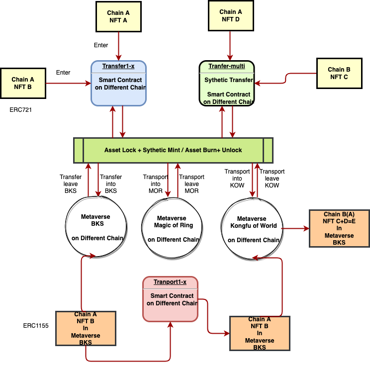

## Abstract
A series of Protocols group to empower the NFTs Interoperability and Composability in Metaverse.
One basic Metaverse registry protocol.
One Interoperability Standard for NFTs transfer into Metaverse with the assets.
One NFTs transport protocol between different Metaverse with the assets.
Build Open ability Interfaces by JSON structure and solidity for Composability.
Split into 3 or 4 parts.

## Motivation
A NFT, what is a record of your DATA(ASSET) on the Blockchain, it is your asset.
A Metaverse is a place where you can interact, communicate, or just make some innovations.
If I owned a NFT, how can I **transfer into one Metaverse**? and how can I **transport from one to another**?

We are building a game in Web3 based on our community NFTs. But we want our hero can join other community games or activities. There is a problem: different NFTs will describe different hero characters and be alive in his Metaverse.
If hero A wants to join hero B’s Metaverse, they must have something with the same definitions. It is this protocol, that defines the SAME INTERACTION rules for NFTs.
Like a **Public Magic Transport** that helps your NFT can fast and easily transfer to your own Metaverse or other one’s garden to be a guest.

We assume that the team or organization who create the NFTs not only sold for JPEGs but want to create something amusing and amazing!
So you can make your girlfriend from 2D on a web page or JPEG, transfer it into a 3D or multi-dimensions, even a digital twin life with this protocol.
And all the teams build so many Metaverse, we need some rules to **define INTERACTIONS rules** between them.
We need a Transport of Magic to help these to be reality and convince.

Our team hold the opinion: the future of Metaverse is depend on the Communities exploration and construction, not the old Giants.
Internet bring the information liquidity, get rid of the information asymmetry, with lowest cost of Internet accessing and rich applications.
How about the Metaverse? all the platforms give the definitions of the Metaverse: you should buy lands, buy expensive NFTs, buy something they made and enter the world they built.
Our team consider the Metaverse use the Blockchain technology like Internet with Http and 7 layer protocols, will and must give the low cost access and everyone can join freely.
So we build this series of protocol to define the rules for Future **Mult-Metaverse World**. Maybe like a shot out by nobody with no echo. But the Ethereum Community is a amazing world, wish good things happening. 
We are Builders of Web3.

## Specification

The key words "MUST", "MUST NOT", "REQUIRED", "SHALL", "SHALL NOT", "SHOULD", "SHOULD NOT", "RECOMMENDED", "MAY", and "OPTIONAL" in this document are to be interpreted as described in RFC 2119.

**Proposed Schema** (subject to "caveats" below):
### Part1:Metaverse Registry
A new registry called `Metaverse Registry` is introduced. This registry defines the formate of a basic definition of  Metaverse and will published with open source mode to collect all the Metaverse metadata and auditing by protocol members or volunteers.  A example below.

```json
{
    "title": "Metaverse Metadata",
    "type": "object",
    "properties": {
        "MID": {
            "type": "string",
            "description": "a unique ID number from 100 to unlimited number"
        },
        "address": {
            "type": "string",
            "description": "how to access the Metaverse, like a domain or contract address"
        },          
        "name": {
            "type": "string",
            "description": "Identifier of the Metaverse"
        },        
        "description": {
            "type": "string",
            "description": "Describes the Metaverse's main activities or topic"
        },
        "image": {
            "type": "string",
            "description": "A URI, pointing to any formate picture in decentralized storage location, 5:3, 5:4 ratio, limited to 10 Mb, suggestion"
        },       
    }
}
```

### Part2: Transfer rules of the Metaverse
A new rule called `Transfer rules ` is introduced. This rule like a door of your Metaverse opened to outside, the NFTs holders can read the information of the door and prepare the data to transfer into this Metaverse. It depend on a lock contract and you can define your entrance form to collect the data of NFTs to run your own business. It will be published with open source mode and auditing by protocol members or volunteers.  A example below.
```json
{
    "title": "Transfer rules of Metaverse",
    "type": "object",
    "properties": {
        "lock": {
            "type": "string",
            "description": "The contract address you locked(staked) your NFT asset."
        },
        "accept": {
            "type": "tuple",
            "description": "define the attributes be accepted, ("","",""), follow Python tuple formate, so can deeply define business"
        },        
        "reject": {
            "type": "tuple",
            "description": "define the attributes be rejected, ("","",""), follow Python tuple formate, so can deeply define business"
        },
        "enhance": {
            "type": "tuple",
            "description": "define the enhance properties and enhance rate("","",""), follow Python tuple formate"
        },  
        "unit": {
            "type": "tuple",
            "description": "define the charge unit and the token contract address, ("","",""), follow Python tuple formate"
        },   
        "limit": {
            "type": "tuple",
            "description": "limitation of the transfer asset into with upper unit,("","",""), follow Python tuple formate"
        },      
        "ticket": {
            "type": "string",
            "description": "ticket fee of this original Metaverse with upper unit"
        },  
        "gift": {
            "type": "tuple",
            "description": "the gift for who transfer into this Metaverse,("","",""), follow Python tuple formate"
        },  
        "activity": {
            "type": "string",
            "description": "a decentralized URI link to the operation activity"
        },           
        "version": {
            "type": "string",
            "description": "this rule version,1.1.12,like this"
        },                                             
    }
}
```

### Part3: Transport rules of the Metaverse
A new rule called `Transport rules ` is introduced. This rule like a magic transport of your Metaverse opened to inside, the players in your Metaverse can read the information of the door and prepare the data to transport into other Metaverse. It depend on your operation and business design. And tuple formate can run your own complicated business. It will be published with open source mode and auditing by protocol members or volunteers.  A example below.
```json
{
    "title": "Transport rules of the Metaverse",
    "type": "object",
    "properties": {
        "list": {
            "type": "tuple",
            "description": "a MID or contract lists that original Metaverse support transport to,follow Python tuple formate"
        },
        "unit": {
            "type": "tuple",
            "description": "define the charge unit and the token contract address, ("","",""), follow Python tuple formate"
        },         
        "ticketA": {
            "type": "string",
            "description": "ticketB of this original Metaverse with upper unit"
        },        
        "ticketB": {
            "type": "string",
            "description": "ticketB of this destination Metaverse with upper unit"
        }, 
        "activity": {
            "type": "string",
            "description": "a decentralized URI link to the operation activity"
        },         
        "version": {
            "type": "string",
            "description": "this rule version,1.1.12,like this"
        },                  
    }
}
```

**Example**
```json
{
  "name": "Metaverse: Killing Boring for Hackers",
  "description": "NFT description",
  "image": "ipfs://QmZfmRZHuawJDtDVMaEaPWfgWFV9iXoS9SzLvwX76wm6pa",
  "namespaces": {
    "myAwesomeCompany": {
      "prop1": "value1",
      "prop2": "value2",
    },
    "myAwesomeCompany2": {
      "prop3": "value3",
      "prop4": "value4",
    },
  }
}

// Or by simply using a `URI` to reduce the size of the JSON response.

{
  "name": "My NFT",
  "description": "NFT description",
  "image": "ipfs://QmZfmRZHuawJDtDVMaEaPWfgWFV9iXoS9SzLvwX76wm6pa",
  "namespaces": {
    "myAwesomeCompany": "URI",
    "myAwesomeCompany2": "URI",
  }
}
```

## Rationale

There are many projects which need custom properties in order to display a current NFT. Each project may have its own way to render the NFTs and therefore they need different values. An example of this is the metaverses like Decentraland or TheSandbox where they need different 3d models to render the NFT based on the visual/engine of each. NFTs projects like Cryptopunks, Bored Apes, etc. can create the 3d models needed for each project and therefore be supported out of the box.

The main differences between the projects that are rendering 3d NFTs (models) are:

- **Armatures**
For example, every metaverse uses its own armature. There is a standard for humanoids but it is not being used for every metaverse and not all the metaverses use humanoids. For example, Decentraland has a different esthetic than Cryptovoxels and TheSandbox. It means that every metaverse will need a different model and they may have the same extension (GLB, GLTF)




- **Metadata (Representations Files)**

For example, every metaverse uses its own metadata representation files to make it work inside the engine depending on its game needs.

This is how a wearable looks like in Decentraland in terms of the config file:
```
"data": {
  "replaces": [],
  "hides": [],
  "tags": [],
  "category": "upper_body",
  "representations": [
    {
      "bodyShapes": [
        "urn:decentraland:off-chain:base-avatars:BaseMale"
      ],
      "mainFile": "male/Look6_Tshirt_A.glb",
      "contents": [
        {
          "key": "male/Look6_Tshirt_A.glb",
          "url": "https://peer-ec2.decentraland.org/content/contents/QmX3yMhmx4AvGmyF3CM5ycSQB4F99zXh9rL5GvdxTTcoCR"
        }
      ],
      "overrideHides": [],
      "overrideReplaces": []
    },
    {
      "bodyShapes": [
        "urn:decentraland:off-chain:base-avatars:BaseFemale"
      ],
      "mainFile": "female/Look6_Tshirt_B (1).glb",
      "contents": [
        {
          "key": "female/Look6_Tshirt_B (1).glb",
          "url": "https://peer-ec2.decentraland.org/content/contents/QmcgddP4L8CEKfpJ4cSZhswKownnYnpwEP4eYgTxmFdav8"
        }
      ],
      "overrideHides": [],
      "overrideReplaces": []
    }
  ]
},
"image": "https://peer-ec2.decentraland.org/content/contents/QmPnzQZWAMP4Grnq6phVteLzHeNxdmbRhKuFKqhHyVMqrK",
"thumbnail": "https://peer-ec2.decentraland.org/content/contents/QmcnBFjhyFShGo9gWk2ETbMRDudiX7yjn282djYCAjoMuL",
"metrics": {
  "triangles": 3400,
  "materials": 2,
  "textures": 2,
  "meshes": 2,
  "bodies": 2,
  "entities": 1
}
```
`replaces`, `overrides`, `hides`, and different body shapes representation for the same asset are needed for Decentraland in order to render the 3D asset correctly.

---

Using `namespaces` instead of objects like the ones below make it easy for the specific vendor/third-parties to access and index the required models. Moreover, `styles` do not exist because there are no standards around for how an asset will be rendered. As I mentioned above, each metaverse for example uses its own armature and esthetic. There is no Decentraland-style or TheSandbox-style that other metaverses use. Each of them is unique and specific for the sake of the platform's reason of being. Projects like Cryptoavatars are trying to push different standards but without luck for the same reasons related to the uniquity of the armature/animations/metadata.

```
{
    "id": "model",
    "type": "model/gltf+json",
    "style": "Decentraland",
    "uri": "..."
},

// Or

{
    "id": "model",
    "type": "model/gltf+json",
    "style": "humanoide",
    "uri": "..."
},
```

With `namespaces` each vendor will know how to render an asset by doing:

```ts
fetch(metadata.namespaces["PROJECT_NAME"].uri).then(res => render(res))
```

The idea behind extending the ERC721 metadata schema is to have backward compatibility as much as possible with existing projects. Chances are that the asset's smart contracts are not upgradeable and therefore if a project wants to be compatible with this EIP, it will need to redeploy and migrate the current contracts. This is very time- and money-consuming. Creating a new token standard that stores the data needed on-chain: 3D models and config files are not the right paths. There are protocols already used for the ERC721 metadata standard like IPFS (the token URI is an IPFS hash). The idea is to leverage this and require as few changes as possible. Moreover, the current metadata standard uses a 2D representation field: `image`. It seems reasonable to have all the representations of an asset in the same place.

## Backwards Compatibility

Existing projects that can't modify the metadata response (schema), may be able to create a new smart contract that based on the `tokenId` returns the updated metadata schema. Of course, the projects may need to accept these linked smart contracts as valid in order to fetch the metadata by the `tokenURI` function.

## Copyright

Copyright and related rights waived via [CC0](https://creativecommons.org/publicdomain/zero/1.0/).h 

## Some words
+ We are curious about the result of search for metaverse on stackexchane: only 7 lines.
+ https://ethereum.stackexchange.com/search?q=metaverse, and in magician forum only one result: https://ethereum-magicians.org/t/proposal-token-interaction-standard/8842.
+ Our team hold the opinion: the future of Metaverse is depend on the Communities exploration and construction, not the old Giants.
+ Internet bring the information liquidity, get rid of the information asymmetry, with lowest cost of Internet accessing and rich applications.
+ How about the Metaverse? all the platforms give the definitions of the Metaverse: you should buy lands, buy expensive NFTs, buy something they made and enter the world they built.
+ Our team consider the Metaverse use the Blockchain technology like Internet with Http and 7 layer protocols, will and must give the low cost access and everyone can join freely.
+ So we build this series of protocol to define the rules. Maybe like a shot out by nobody with no echo. But the Ethereum Community is a amazing world, wish good things happening. 
+ We are Builders of Web3.
